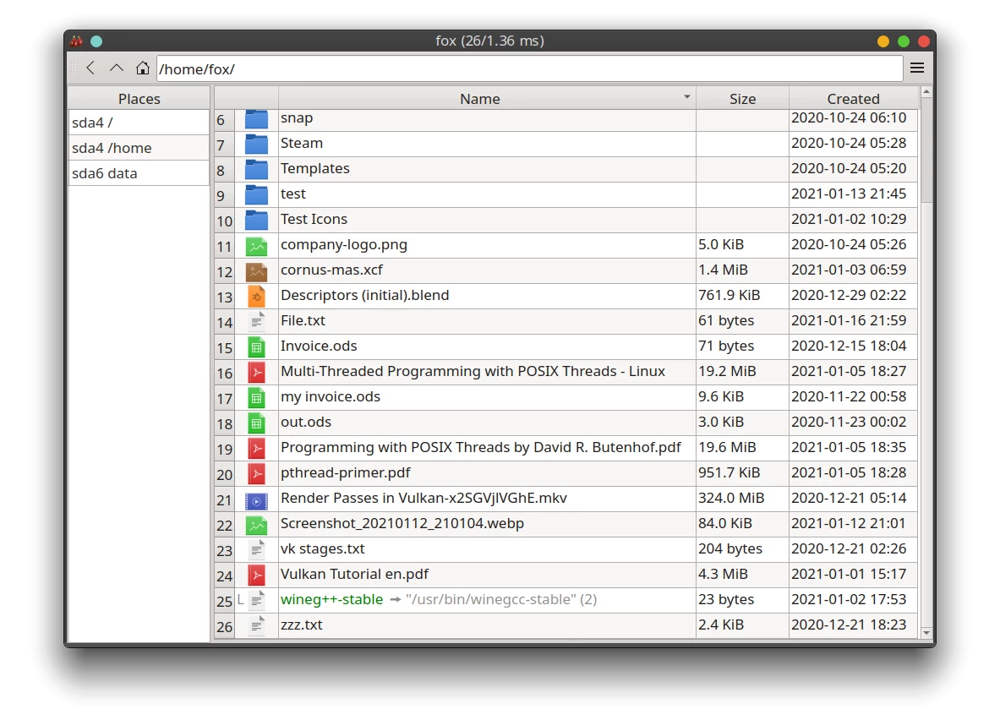

### Cornus - a fast file browser for Linux written in C++17 and Qt5.

##### How to build:
* sudo apt-get install libdconf-dev qt5-default
* mkdir build
* cd build
* cmake ..
* make -j4

##### Application Shortcuts:

* Alt+Up => Move one directory up
* Alt+H => Toggle show hidden files
* Alt+Q => Quit app
* Shift+Delete => Delete selected files
* F2 => Rename selected file
* Ctrl+I => Focus table
* Ctrl+L => Focus address bar
* Ctrl+A => Select all files
* Ctrl+E => Toggle exec bit of selected file(s)
* R => Display contents of selected file

---
##### BTC: bc1qzs8ux6m0t4jj98furra8pvx2ll80qchr5v4ru6

---
### Screenshot (or see resources/Screenshot.webp):

