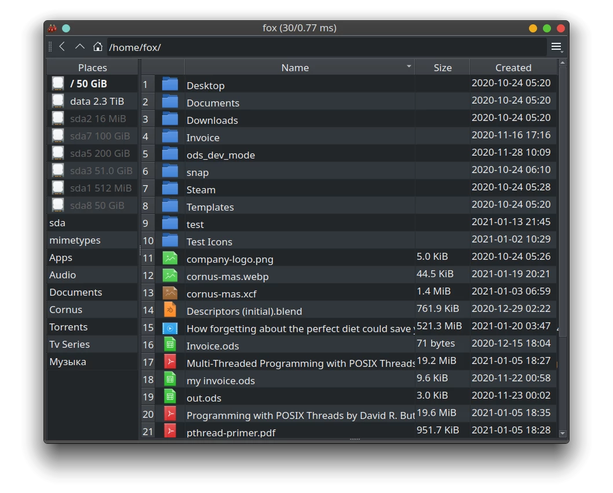
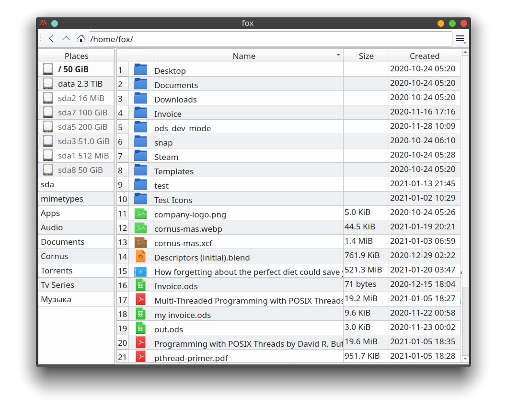

### Cornus - a fast file browser for KDE Linux written in C++17 and Qt5.

##### Requirements: Linux 5.3+, Qt 5.15.2+
---
Building on Ubuntu:
* sudo apt-get install qt5-default libdbus-c++-dev libudisks2-dev libdconf-dev cmake git ark
* mkdir build
* cd build
* cmake ..
* make -j4

##### Application Shortcuts:

* Alt+Up => Move one directory up
* Ctrl+H => Toggle show hidden files
* Ctrl+Q => Quit app
* Shift+Delete => Delete selected files
* F2 => Rename selected file
* Ctrl+I => Focus table
* Ctrl+L => Focus address bar
* Ctrl+A => Select all files
* Ctrl+E => Toggle exec bit of selected file(s)
* D => Display contents of selected file
* Ctrl+F => Search for file by name (then hit Enter to search forward or Ctrl+Enter for backwards)

---
##### BTC: bc1qzs8ux6m0t4jj98furra8pvx2ll80qchr5v4ru6

---
### Screenshot with dark theme:

### Screenshot with light theme:

##### Differences from other file browsers like Nautilus or Dolphin:
* If needed right click a file -> Open With -> Preferences... to set a default app with which to open a given type of file.
* To see the tree of links of a symbolic link double-click the icon of the link in the browser.
* Press 'D' after selecting a non-folder to display its contents. The built-in text editor is meant for a quick update of its contents or a glean into the file, not as a full blown text editor. Files' contents unrecognized as text files are opened in read-only mode.
*  You can easily set your own icons for files of different types by dropping an icon into the "file_icons" folder with the proper extension as its name, browse the folder "file_icons" to see what I mean.
* "cornus_io" is the I/O daemon that is started automatically, keep it in the same folder as "cornus".
