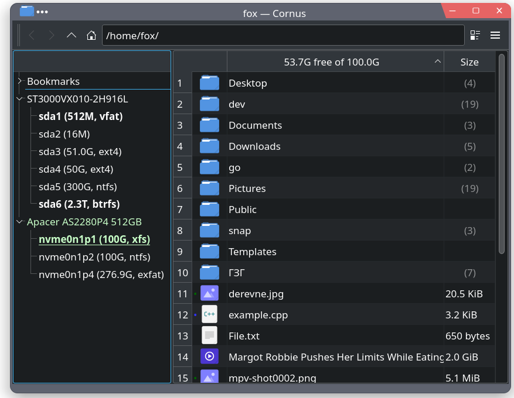
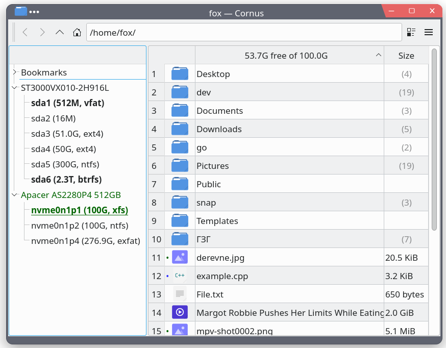

### Cornus - a fast file browser for KDE Linux written in C++17 and Qt5.

##### Requirements: Linux 5.5+, Qt 5.15.2+
---

##### Warning: the Qt <u>Wayland</u> backend is broken, i.e. the clipboard doesn't work.
The Qt devs have to fix their toolkit.

---
Building on Ubuntu, install Qt5 (used to be called qt5-default):
* sudo apt-get install qtbase5-dev qtchooser qt5-qmake qtbase5-dev-tools

Then the other dependencies:
* sudo apt-get install libwebp-dev libwebm-dev libdbus-c++-dev libudev-dev libudisks2-dev libzstd-dev libmtp-dev libpolkit-gobject-1-dev libpolkit-agent-1-dev mkvtoolnix cmake ark git

And build it:
* mkdir build && cd build
* cmake ..
* make -j4

The file browser executable is "cornus", "cornus_io" is the IO daemon that is started automatically when needed.
To have a .desktop launcher on your desktop - update the file at export/cornus_mas.desktop (the "Icon" and "Exec" fields) accordingly and copy this file to your desktop folder.

##### Major TODO items:
* Icons View mode (currently in development)
* MTP to deal with Android devices

---
### Screenshot with dark theme:

### Screenshot with light theme:

#### Things you should know:
* Files with the executable bit set are marked green.
* To set a default app to open a given type of file right click a file -> Open With -> Preferences...
* To see the tree of links of a symbolic link - when in details view click the icon of the link.
* Press 'D' after selecting a non-folder to display its contents (or click its icon). The built-in text editor is meant for a quick update of its contents or a glean into the file, not as a full blown text editor. Files' contents unrecognized as text files are opened in read-only mode.
* Shift+Delete = delete permanently, Delete = move to trash.
* A grey dot near the icon of the file means the file has extended attributes,
a blue one means it has media related extended attributes.
* To launch Cornus from the command line and get it to select a folder at startup: 
To select the folder "Documents" from ${HOME}: 
`cornus ${HOME} --select Documents` 
or 
`cornus ${HOME} --select "My Folder With Whitespaces"` 
To select "File.txt" from ${HOME}: 
`cornus ${HOME}/File.txt` 
or: 
`cornus ${HOME} --select File.txt` 
or: 
`cornus ${HOME} --select "My File With Whitespaces.txt"` 
* You can easily set your own icons for files of different types by dropping an icon into the "file_icons" folder with the proper extension as its name, browse the folder "file_icons" to see what I mean, probably located at "/usr/share/cornus/file_icons".
* File icons are loaded from "$HOME/.config/CornusMas/file_icons", then if not found from "/usr/share/cornus/file_icons".

